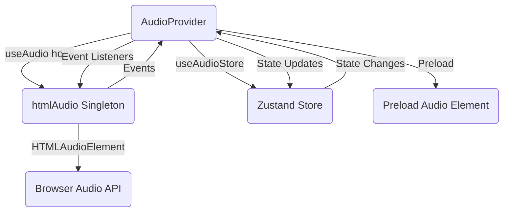

The `AudioProvider` component is the core of the audio system. It manages the HTML audio element lifecycle, synchronizes playback state with the Zustand store, handles errors with automatic retries, and preloads tracks for seamless playback.

## Installation

<CodeTabs>
  <TabsList>
    <TabsTrigger value="cli">CLI</TabsTrigger>
    <TabsTrigger value="manual">Manual</TabsTrigger>
  </TabsList>
  <TabsContent value="cli">
  ```bash
  npx shadcn@latest add @audio/provider
  ```
  </TabsContent>

  <TabsContent value="manual">
    <Steps>
      <Step>Install the runtime dependencies:</Step>

        ```bash
        npm install zustand
        ```

      <Step>Install the required registry components:</Step>

        ```bash
        npx shadcn@latest add @audio/store @audio/html @audio/use-audio
        ```

      <Step>Copy and paste the following code into your project.</Step>
        <Source name="provider" title="components/audio/provider.tsx" />
      <Step>Copy the required store file.</Step>
        <Source name="store" title="lib/audio-store.ts" />
      <Step>Copy the audio lib file.</Step>
        <Source name="html" title="lib/html-audio.ts" />
      <Step>Copy the useAudio hook file.</Step>
        <Source name="use-audio" title="hooks/use-audio.ts" />
      <Step>Update the import paths to match your project setup.</Step>
    </Steps>

  </TabsContent>
</CodeTabs>

## Setup

Wrap your app with `AudioProvider` at the root level. This provides the audio context to all components.

```tsx showLineNumbers
// app/layout.tsx or _app.tsx
import { AudioProvider } from "@/components/audio/provider";

export default function RootLayout({ children }) {
  return (
    <html>
      <body>
        <AudioProvider tracks={initialTracks}>{children}</AudioProvider>
      </body>
    </html>
  );
}
```

<Callout variant="info">
  <strong>Required:</strong> The <code>AudioProvider</code> must wrap all components
  that use audio functionality. It initializes the audio singleton, manages event
  listeners, and synchronizes state between the HTML audio element and the Zustand
  store.
</Callout>

## Usage

### Basic

```tsx
import { AudioProvider } from "@/components/audio/provider";

const tracks = [
  {
    id: "1",
    title: "Track 1",
    artist: "Artist 1",
    url: "https://example.com/track1.mp3",
  },
];

function App() {
  return (
    <AudioProvider tracks={tracks}>
      <YourAudioComponents />
    </AudioProvider>
  );
}
```

### With Dynamic Tracks

```tsx
import { AudioProvider } from "@/components/audio/provider";
import { useState } from "react";

function App() {
  const [tracks, setTracks] = useState([]);

  return (
    <AudioProvider tracks={tracks}>
      <YourAudioComponents />
    </AudioProvider>
  );
}
```

## API Reference

### AudioProvider

#### Props

| Prop      | Type       | Default | Description                                                      |
| --------- | ---------- | ------- | ---------------------------------------------------------------- |
| `tracks`  | `Track[]`  | `[]`    | Initial array of tracks to populate the queue.                  |
| `children` | `ReactNode` | -      | Child components that will have access to the audio context.    |

#### Features

- **Audio Element Management**: Initializes and manages the HTML audio element lifecycle
- **State Synchronization**: Keeps Zustand store in sync with audio element state
- **Error Handling**: Automatic retry logic (up to 3 attempts with exponential backoff)
- **Track Preloading**: Preloads the next track in the queue for seamless playback
- **Event Handling**: Listens to all audio events (play, pause, error, ended, timeupdate, etc.)
- **State Restoration**: Restores playback state from localStorage on mount
- **Live Stream Support**: Handles live streams with appropriate timeouts and seeking restrictions

## Architecture



## How It Works

### Initialization

1. **Audio Singleton**: Uses `useAudio()` hook to access the `htmlAudio` singleton
2. **Audio Element**: Calls `htmlAudio.init()` to ensure the audio element is created
3. **Event Listeners**: Attaches event listeners to the audio element using `AbortController` for cleanup
4. **State Subscriptions**: Subscribes to Zustand store changes for `isPlaying`, `currentTrack`, `volume`, etc.

### State Synchronization

The provider maintains bidirectional synchronization:

- **Store → Audio**: When store state changes (e.g., `isPlaying`, `volume`), the provider updates the audio element
- **Audio → Store**: When audio events fire (e.g., `play`, `pause`, `timeupdate`), the provider updates the store

### Error Handling

The provider implements automatic error recovery:

1. **Error Detection**: Listens to `error` events from the audio element
2. **Error Classification**: Determines if the error is recoverable (network issues) or fatal (decoding errors)
3. **Retry Logic**: Automatically retries up to 3 times with exponential backoff (1s, 2s, 4s)
4. **Error State**: Updates store with error information if all retries fail

### Track Preloading

To ensure seamless playback:

1. **Next Track Calculation**: Calculates the next track based on queue, shuffle, and repeat mode
2. **Background Loading**: Preloads the next track in a separate audio element
3. **Automatic Cleanup**: Clears preload when queue changes or component unmounts

## Examples

### With Player Components

```tsx
import { AudioProvider } from "@/components/audio/provider";
import { AudioPlayer, AudioPlayerPlay } from "@/components/audio/player";

const tracks = [
  { id: "1", title: "Track 1", url: "https://example.com/track1.mp3" },
];

function App() {
  return (
    <AudioProvider tracks={tracks}>
      <AudioPlayer>
        <AudioPlayerPlay />
      </AudioPlayer>
    </AudioProvider>
  );
}
```

### With Queue Management

```tsx
import { AudioProvider } from "@/components/audio/provider";
import { AudioQueue } from "@/components/audio/queue";

function App() {
  return (
    <AudioProvider tracks={tracks}>
      <AudioQueue />
    </AudioProvider>
  );
}
```

## Notes

<Callout variant="info">
  <strong>Important Information:</strong>

  - **Singleton Pattern**: The provider uses the `htmlAudio` singleton from `useAudio()` hook. This ensures a single audio element is shared across the entire app.
  - **Event Cleanup**: Uses `AbortController` to automatically clean up all event listeners when the component unmounts.
  - **State Restoration**: Automatically restores playback state (current track, position, volume) from localStorage on mount.
  - **Throttled Updates**: Time updates are throttled to 100ms to prevent excessive re-renders while maintaining smooth UI updates.
  - **Live Stream Detection**: Automatically detects live streams based on duration (NaN, Infinity) and adjusts behavior accordingly.
</Callout>

<Callout variant="warning">
  <strong>Error Handling:</strong> The provider implements silent error handling. All
  errors are handled internally with retry logic and state updates. No console errors
  are logged unless explicitly configured.
</Callout>

## Related

- [Audio Player](/docs/components/player) — Player UI components
- [Audio Store](/docs/lib/audio-store) — Zustand store for state management
- [Audio Library](/docs/lib/audio) — Core audio singleton
- [useAudio Hook](/docs/hooks/use-audio) — React hook for audio access

## Changelog

### 2025-12-24 Provider refactoring and useAudio integration

- **Added**: Integration with `useAudio()` hook for accessing audio singletons
- **Changed**: Replaced direct `$audio` usage with `htmlAudio` from `useAudio()` hook
- **Improved**: Event listener management using `AbortController` for cleaner cleanup
- **Improved**: State synchronization logic for better reliability
- **Fixed**: Slider synchronization when pausing and resuming playback
- **Removed**: All console error logging (silent error handling)
- **Improved**: React Compiler optimization compatibility

