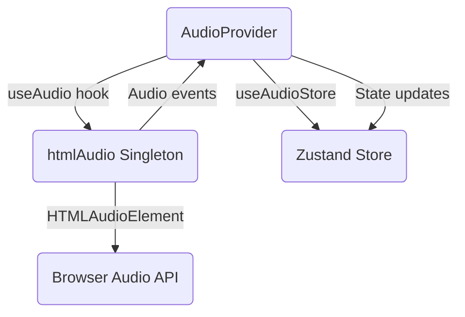

The provider that connects the audio element to your app state.

## Installation

<CodeTabs>
  <TabsList>
    <TabsTrigger value="cli">CLI</TabsTrigger>
    <TabsTrigger value="manual">Manual</TabsTrigger>
  </TabsList>
  <TabsContent value="cli">
    <Install component="provider" />
  </TabsContent>

  <TabsContent value="manual">
    <Steps>
      <Step>Install the runtime dependencies:</Step>
        <Install pkg="zustand" />
      <Step>Install the required registry components:</Step>
        <Install component="store html use-audio" />

      <Step>Copy and paste the following code into your project.</Step>
        <Source name="provider" title="components/audio/provider.tsx" />
      <Step>Copy the required store file.</Step>
        <Source name="store" title="lib/audio-store.ts" />
      <Step>Copy the audio lib file.</Step>
        <Source name="html" title="lib/html-audio.ts" />
      <Step>Copy the useAudio hook file.</Step>
        <Source name="use-audio" title="hooks/use-audio.ts" />
      <Step>Update the import paths to match your project setup.</Step>
    </Steps>

  </TabsContent>
</CodeTabs>

## Setup

Wrap your app with `AudioProvider` at the root level.

```tsx showLineNumbers
import { AudioProvider } from "@/components/audio/provider";
```

```tsx showLineNumbers
// app/layout.tsx or _app.tsx

export default function RootLayout({ children }) {
  return (
    <html>
      <body>
        <AudioProvider tracks={initialTracks}>{children}</AudioProvider>
      </body>
    </html>
  );
}
```

## Usage

Start with this default setup:

```tsx
import { AudioProvider } from "@/components/audio/provider";
```

```tsx
const tracks = [
  {
    id: "1",
    title: "Track 1",
    artist: "Artist 1",
    url: "https://example.com/track1.mp3",
  },
];

export function App() {
  return (
    <AudioProvider tracks={tracks}>
      <YourAudioComponents />
    </AudioProvider>
  );
}
```

### With Dynamic Tracks

```tsx
import { AudioProvider } from "@/components/audio/provider";
import { useState } from "react";
```

```tsx
export function App() {
  const [tracks, setTracks] = useState([]);

  return (
    <AudioProvider tracks={tracks}>
      <YourAudioComponents />
    </AudioProvider>
  );
}
```

## API Reference

### AudioProvider

| Prop      | Type       | Default | Description                                                      |
| --------- | ---------- | ------- | ---------------------------------------------------------------- |
| `tracks`  | `Track[]`  | `[]`    | Initial array of tracks to populate the queue.                  |
| `children` | `ReactNode` | -      | Child components that will have access to the audio context.    |

## Architecture


```mermaid
graph TB
    A(AudioProvider) -->|useAudio hook| B(htmlAudio Singleton)
    A -->|useAudioStore| C(Zustand Store)
    B -->|HTMLAudioElement| D(Browser Audio API)
    B -->|Audio events| A
    A -->|State updates| C
```

## Notes

<Callout variant="info">
  <strong>Required:</strong> Components that read audio state from the store
  need this provider mounted at the app root.
</Callout>

<Callout variant="warning">
  <strong>Behavior:</strong> Playback and queue state are synchronized through
  the provider lifecycle. Mount it once at the top level.
</Callout>

## Related

- [Audio Player](/docs/components/player) - Player UI components
- [Audio Store](/docs/lib/audio-store) - Zustand store for state management
- [HTML Audio](/docs/lib/html-audio) - Core audio singleton

## Changelog

### 2025-12-24 Provider refactoring and useAudio integration

- **Added**: Integration with `useAudio()` hook for accessing audio singletons
- **Changed**: Replaced direct `$audio` usage with `htmlAudio` from `useAudio()` hook
- **Improved**: Event listener management using `AbortController` for cleaner cleanup
- **Improved**: State synchronization logic for better reliability
- **Fixed**: Slider synchronization when pausing and resuming playback
- **Removed**: All console error logging (silent error handling)
- **Improved**: React Compiler optimization compatibility

